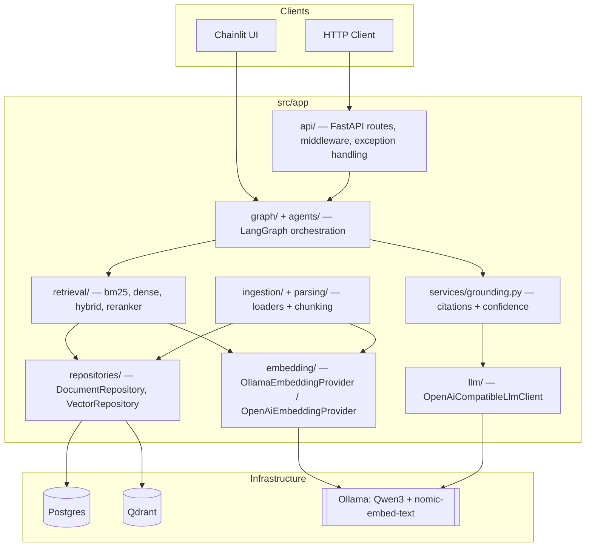

# Architecture

Enterprise RAG follows a layered / hexagonal architecture: dependencies point inward
(API → Agents/Services → Repositories/Domain), and every infrastructure dependency
(Qdrant, Postgres, Ollama) sits behind a narrow interface so it can be swapped without
touching callers.

## Component Diagram



## Layering Rules

- `api/` depends on the agent graph (`graph/`, `agents/`), never on `repositories/` or infra
  clients directly.
- `agents/` and `services/` depend on `repositories/` and domain interfaces (`embedding/`,
  `llm/`, `retrieval/`), never on FastAPI types.
- `repositories/` depends on `database/`/`vectorstore/` clients, never on `agents/`/`services/`.
- All infra clients (Qdrant, Postgres, Ollama) are wrapped behind `Protocol` interfaces so
  providers can be swapped (e.g. Ollama → OpenAI) without touching callers.

## Package Layout

```
src/app/
    api/            # FastAPI routers, middleware, exception handling — no business logic
    core/           # Cross-cutting exceptions/base types
    config/         # Pydantic Settings, environment-driven configuration
    logging/        # structlog setup, correlation ID middleware
    ingestion/      # document loaders (PDF/DOCX/TXT/MD/CSV/XLSX/PPTX) + OCR abstraction
    parsing/        # chunking, metadata extraction
    embedding/      # EmbeddingProvider interface + Ollama/OpenAI implementations
    retrieval/
        bm25/       # sparse lexical retrieval (Okapi BM25)
        dense/      # vector similarity retrieval (Qdrant)
        hybrid/     # weighted score fusion of bm25 + dense
        reranker/   # reranker interface (concrete providers are future work)
    llm/            # OpenAI-compatible LLM client abstraction (Ollama/Qwen3 backend)
    prompts/        # externalized prompt templates
    agents/         # LangGraph node implementations
    graph/          # LangGraph graph assembly/wiring
    services/       # grounding / citation verification
    repositories/   # persistence abstractions (Postgres, Qdrant) behind interfaces
    models/         # domain entities (Pydantic)
    database/       # Postgres async engine/session management
    vectorstore/    # Qdrant client wrapper

chainlit/           # Chainlit chat UI
docker/             # per-service Dockerfiles (fastapi, chainlit, postgres, qdrant, ollama)
tests/              # unit/ (96%+ coverage), api/ (FastAPI TestClient integration tests)
```

See [sequence.md](sequence.md) for request-flow and agentic-graph diagrams.
