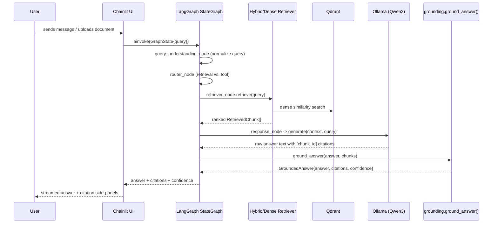
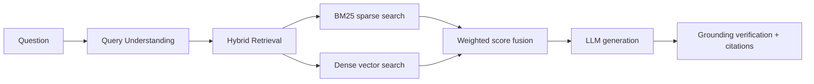
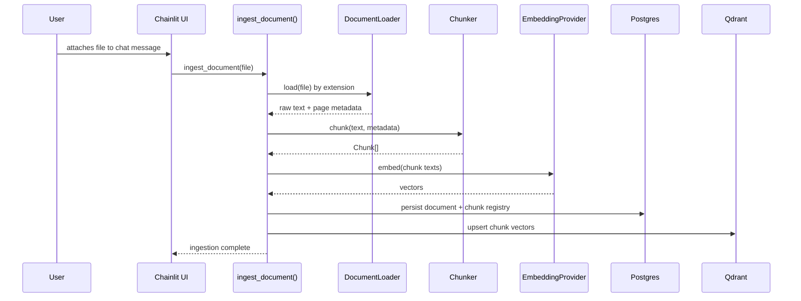

# Sequence & Flow Diagrams

## Chat Request Flow (Chainlit → LangGraph)



## Retrieval Pipeline



## Agentic Graph (LangGraph `StateGraph`)

```mermaid
flowchart TD
    Start([Start]) --> QU[Query Understanding Node]
    QU --> Router[Router Node]
    Router -->|retrieval needed| Retriever[Retriever Node]
    Router -->|"tool:"/"calc:" prefix| Tool[Tool Node]
    Retriever --> Response[Response Node + Grounding]
    Tool --> Response
    Response --> End([End])
```

The router uses a deterministic prefix heuristic (`"tool:"`/`"calc:"`) today; an LLM-based
classifier is a natural future extension without changing the graph shape.

## Document Ingestion Flow



See [architecture.md](architecture.md) for the static component view.
